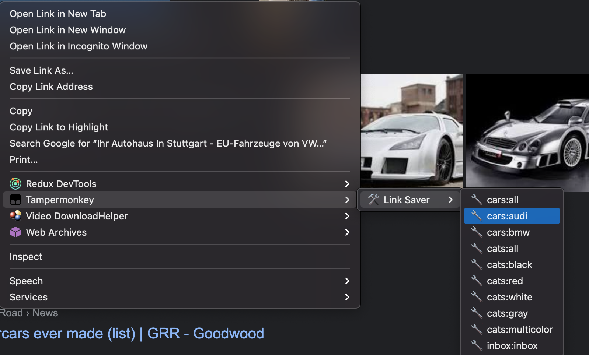

# What is it

This app allow you to right click some links on website and immediately save them into appropriate google sheets

# Why

I've created it coz like to save those links "for later" (later usually never come), in other words I'm hoarder. Without app, I just opened all of those links in new tabs - plan was to come back, when I have time, and store all those links in google sheets and close those tabs, but.. there are never "have time". So I had dozens and dozens of open tabs. With app ON, I just save that links without even opening them. Perfect!

# How does it work

App consists of 2 parts: tampermonkey plugin and local server:

### Tampermonkey plugin

You create a new script in your tampermonkey dashboard, copy there everything  from `tampermonkeyCode.js`
and replace `<PUT_tables.json_CONTENT_HERE>` and `<PUT_HERE_VALUE_FROM_.env_FILE>` with corresponding values.
To get `tables.json` file, just rename `tables.ts.REMOVE_THIS_PART` and update it content to your needs. To get `.env` file, rename `.env.REMOVE_THIS_PART` (you don't need most of fields in this file, however).

If everything gone right and your script works well, you should have new additional context menus, like on this image:

Keep in mind, `Tampermonkey` context menu may appear with delay or not appear at all - just wait, reload page or go google and fix it ;) It's line `// @grant           GM_registerMenuCommand` which allow us to add new context menus.

If you never used tampermonkey before, start from something easier, like create a script with simple alert or console.log and make sure it works on your pages. Then try script from link-saver.

Anyway, when you click on one of menus, request will be sent to local server. This server:

### Local server

Handle queries, like `http://localhost:3000/?table=cars&tab=audi&href=https://www.googleadservices.com/pagead/aclk?sa=L`. It parse it for its composits: `table name`, `tab name` and `href`. Then server search for first empty cell in sayd table/tab and write `href` there. If tab contains 178 filled cells, new `href` will be wrote down to `A179`.

You should rename tables.ts.REMOVE_THIS_PART and fill it with your own values. `name` field is used only to make frontend (tampermonkey script) know which table we use (and we show `name` in context menus) - so you can choose any, `spreadsheedId` and `tabs` are google sheet id and names of tabs in this google sheet. You can see `spreadsheetId` in address of you sheet. For example, here `https://docs.google.com/spreadsheets/d/1dGsN1WZuiWl2efdjqcpUQsX_JBeyVRHeHNvnt-on9ho/edit#gid=1064958507` its `1dGsN1WZuiWl2efdjqcpUQsX_JBeyVRHeHNvnt-on9ho`.

How to work with server:
- go to https://console.cloud.google.com/, create new project, create new OAuth2 creds, choose `http://localhost:3000/oauth2callback` for redirect URI, download `client_secret.json` file and store it in root of project. See https://github.com/googleapis/google-api-nodejs-client#oauth2-client ("OAuth 2 client" part of readme) for more information.
- run `npm run refreshGoogleAuth` to update `googleTokens.json` - you will finish full OAuth2 workflow.
- run `npm start` - it will create server which handle queries from frontend. You should keep this server up whenever you want to right-click-save your links.

Please, don't use my email to contact me - I never read it. For any questions, here is my telegram: anatoliy_bondar_ua